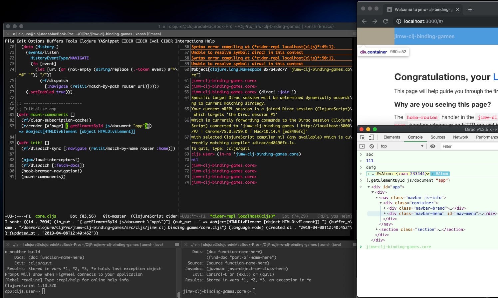

# jimw-clj-binding-games



## Develop

```bash
./lein figwheel

./lein run

./lein repl

/Applications/Google\ Chrome\ Canary.app/Contents/MacOS/Google\ Chrome\ Canary \
  --remote-debugging-port=9222 \
  --no-first-run \
  --user-data-dir=.test-dirac-chrome-profile

`open 127.0.0.1:3000 & open dirac devtools `

```

## License

Copyright © 2019 SteveChan
